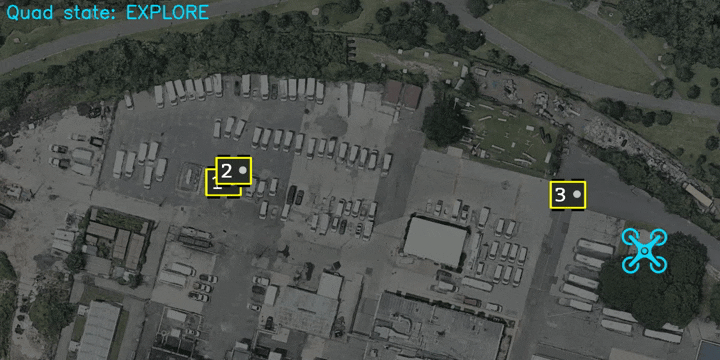

air_router
---------



air_router replaces the waypoint mission following in PX4-based flight controllers for a high-altitude robot. We use it to maximize communication in a multi-robot setting, where the aerial robot can fly over ground robots and act as a data mule.

## Instructions

To use this node, you should create a QGC mission with the following
characteristics:

1. We take the take off waypoint as the origin (command 22). Please be sure to
   align this takeoff point with your image origin.

2. Be sure to create **only one** fence (inclusion fence), and be sure that all the waypoints are
   within the fence.

3. You can create as many *no fly* zones as you want (exclusion fences).

## Citation

If you find air_router useful, please cite:

```
@INPROCEEDINGS{cladera2024enabling,
  author={Cladera, Fernando and Ravichandran, Zachary and Miller, Ian D. and Ani Hsieh, M. and Taylor, C. J. and Kumar, Vijay},
  booktitle={2024 IEEE International Conference on Robotics and Automation (ICRA)},
  title={{Enabling Large-scale Heterogeneous Collaboration with Opportunistic Communications}},
  year={2024},
  pages={2610-2616},
  doi={10.1109/ICRA57147.2024.10611469}
}
```
