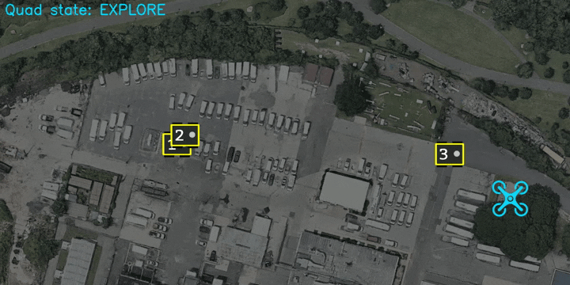

air_router
---------



air_router replaces the waypoint mission following in PX4-based flight controllers for a high-altitude robot. We use it to maximize communication in a multi-robot setting, where the aerial robot can fly over ground robots and act as a data mule.

## Instructions

To use this node, you should create a QGC mission with the following
characteristics:

1. We take the take off waypoint as the origin (command 22). Please be sure to
   align this takeoff point with your image origin.

2. Be sure to create **only one** fence (inclusion fence), and be sure that all the waypoints are
   within the fence.

3. You can create as many *no fly* zones as you want (exclusion fences).


## Simulation Setup

The ROS2 version of air_router supports the PX4 Gazebo simulation. Follow the below steps to set up the simulation:

1. If you do not already have it installed, clone and configure the PX4 Autopilot repo. This is customarily placed in the user's home directory.

```bash
git clone https://github.com/PX4/PX4-Autopilot.git --recursive
bash ./PX4-Autopilot/Tools/setup/ubuntu.sh
```

You may need to reboot after the above.

2. Install MAVROS for your ROS2 version:

```bash
sudo apt install ros-<ros-distro>-mavros
```

3. Launch Gazebo sim through the PX4 autopilot.

```bash
cd ~/PX4-Autopilot
make px4_sitl gz_x500
```

4. Within your ROS2 workspace, launch MAVROS:

```bash
ros2 launch mavros px4.launch fcu_url:=udp://:14540@127.0.0.1
```

MAVROS will likely complain that the origin isn't set. You can set it using:

```bash
ros2 topic pub /mavros/global_position/set_gp_origin geographic_msgs/msg/GeoPointStamped "{header: {frame_id: 'map'}, position: {latitude: 47.3979712, longitude: 8.5461636, altitude: 30.0}}"
```

You should now be able to list and echo MAVROS topics. You can launch the nimbus stack using the nimbus launch file. This launch file simply runs the autopilot stack and does not execute a mission. 

```bash
ros2 launch nimbus nimbus.launch
```

## Citation

If you find air_router useful, please cite:

```
@INPROCEEDINGS{cladera2024enabling,
  author={Cladera, Fernando and Ravichandran, Zachary and Miller, Ian D. and Ani Hsieh, M. and Taylor, C. J. and Kumar, Vijay},
  booktitle={2024 IEEE International Conference on Robotics and Automation (ICRA)},
  title={{Enabling Large-scale Heterogeneous Collaboration with Opportunistic Communications}},
  year={2024},
  pages={2610-2616},
  doi={10.1109/ICRA57147.2024.10611469}
}
```
